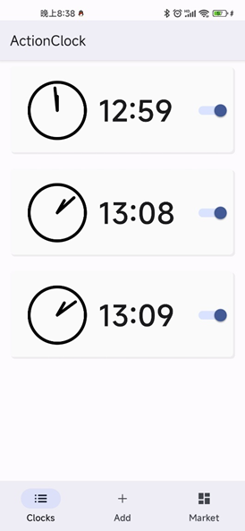
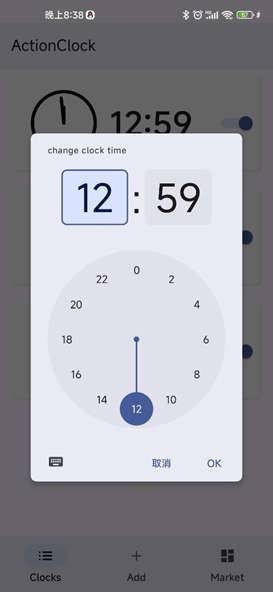
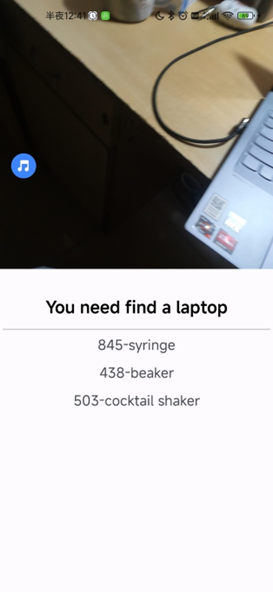

# Action Clock

You set a clock(inaccurate) and lock object, and close it by shooting your specified object

> Service+CNN deployment+BroadcastReceiver+Room+Material

- clock list
    

- Add Clock
    
- Clock
    
